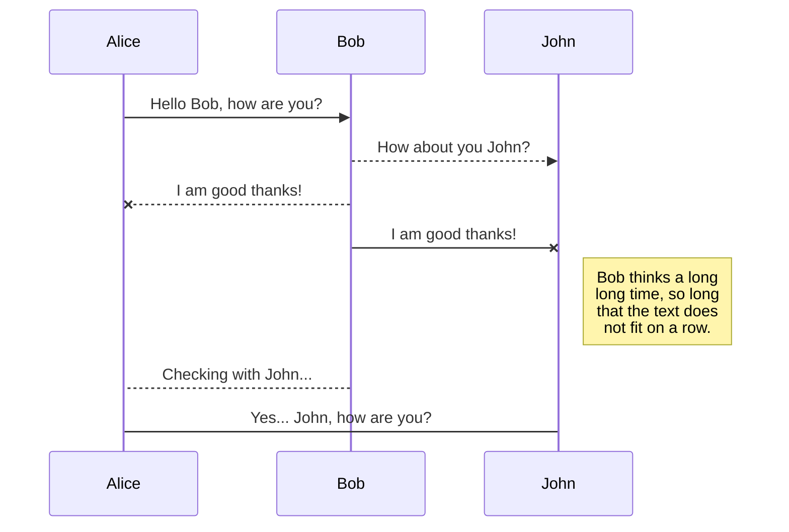
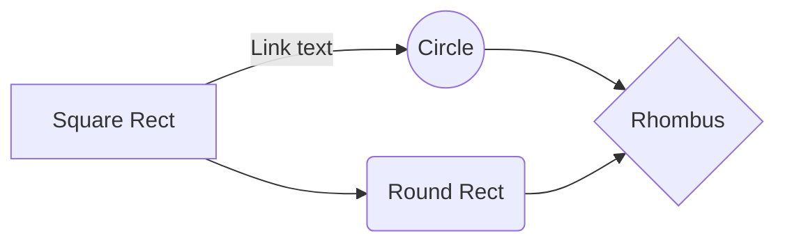

# # [High Performance TiDB]_Week 02：对 TiDB 进行基准测试

本週心得：

## 題目要求

```reStructuredText
使用 sysbench、go-ycsb 和 go-tpc 分别对 TiDB 进行测试并且产出测试报告。  
测试报告需要包括以下内容：  
  
* 部署环境的机器配置(CPU、内存、磁盘规格型号)，拓扑结构(TiDB、TiKV 各部署于哪些节点)  
* 调整过后的 TiDB 和 TiKV 配置  
* 测试输出结果  
* 关键指标的监控截图  
* TiDB Query Summary 中的 qps 与 duration  
* TiKV Details 面板中 Cluster 中各 server 的 CPU 以及 QPS 指标  
* TiKV Details 面板中 grpc 的 qps 以及 duration  
  
输出：写出你对该配置与拓扑环境和 workload 下 TiDB 集群负载的分析，提出你认为的 TiDB 的性能的瓶颈所在(能提出大致在哪个模块即 可)  
  
截止时间：下周二（8.25）24:00:00(逾期提交不给分)
```

## 背景與環境準備

### 環境準備
這次使用的是 multipass 來準備虛擬環境（可以參考 [Multipass 介紹](https://sysadmins.co.za/getting-started-with-multipass-vms/)），因為 tiup 進行主機操作時可選擇用 key 或是密碼登入，同時該帳號要具備 root 權限，因此先準備 ssh private key，再用 cloud-init 的方式設定 multipass VM。

- 產生給 cloud-init 用的 ssh public key：
```
    ssh-keygen -b 2048 -f ~/.ssh/multipass -t rsa -q -N ""
```
這邊要注意一下，因為自己在建置過程中有使用 tiup destroy 重新建立 VM，執行 tiup destroy 的時候會順便把 ssh key 刪除（？！？！），所以記得要把這個 key 保留好。

- 把產生的 pubkey 到 cloud-init.yaml
```
$ cat ./cloud-init.yaml
#cloud-config
ssh_authorized_keys:
  - ssh-rsa AAAAB3.......hh32R ruan@mbp
```

- 生成 VM，依照規格用 script 產生，配置如下。

TODO

- 使用 tiup 佈署，不得不說，使用 tiup 實在沒什麼技術難點，只要將 topology.yaml 準備好進行 tiup 安裝很簡單就可以完成。先測試最小架構：

```
global:
  user: "tidb"
  ssh_port: 22
  deploy_dir: "/tidb-deploy"
  data_dir: "/tidb-data"

pd_servers:
  - host: 10.149.251.115
  - host: 10.149.251.137
  - host: 10.149.251.239

tidb_servers:
  - host: 10.149.251.121
  - host: 10.149.251.223
  - host: 10.149.251.140

tikv_servers:
  - host: 10.149.251.15
  - host: 10.149.251.214
  - host: 10.149.251.173

monitoring_servers:
  - host: 10.149.251.56

grafana_servers:
  - host: 10.149.251.56

alertmanager_servers:
  - host: 10.149.251.56
```
- 執行安裝

```shell
tiup cluster deploy tidb-test v4.0.0 ./topology.yaml --user ubuntu -i ~/.ssh/id_rsa
```
畫面跳出確認 topology 是否正確，執行 y 

- 檢查安裝結果

```
:~ $  tiup cluster display cluster-test

Starting component `cluster`:  display tidb-test
tidb Cluster: tidb-test
tidb Version: v4.0.0
ID                    Role          Host            Ports        OS/Arch       Status  Data Dir                      Deploy Dir
--                    ----          ----            -----        -------       ------  --------                      ----------
10.149.251.56:9093    alertmanager  10.149.251.56   9093/9094    linux/x86_64  Up      /tidb-data/alertmanager-9093  /tidb-deploy/alertmanager-9093
10.149.251.56:3000    grafana       10.149.251.56   3000         linux/x86_64  Up      -                             /tidb-deploy/grafana-3000
10.149.251.115:2379   pd            10.149.251.115  2379/2380    linux/x86_64  Up      /tidb-data/pd-2379            /tidb-deploy/pd-2379
10.149.251.137:2379   pd            10.149.251.137  2379/2380    linux/x86_64  Up|L    /tidb-data/pd-2379            /tidb-deploy/pd-2379
10.149.251.239:2379   pd            10.149.251.239  2379/2380    linux/x86_64  Up|UI   /tidb-data/pd-2379            /tidb-deploy/pd-2379
10.149.251.56:9090    prometheus    10.149.251.56   9090         linux/x86_64  Up      /tidb-data/prometheus-9090    /tidb-deploy/prometheus-9090
10.149.251.121:4000   tidb          10.149.251.121  4000/10080   linux/x86_64  Up      -                             /tidb-deploy/tidb-4000
10.149.251.140:4000   tidb          10.149.251.140  4000/10080   linux/x86_64  Up      -                             /tidb-deploy/tidb-4000
10.149.251.223:4000   tidb          10.149.251.223  4000/10080   linux/x86_64  Up      -                             /tidb-deploy/tidb-4000
10.149.251.15:20160   tikv          10.149.251.15   20160/20180  linux/x86_64  Up      /tidb-data/tikv-20160         /tidb-deploy/tikv-20160
10.149.251.173:20160  tikv          10.149.251.173  20160/20180  linux/x86_64  Up      /tidb-data/tikv-20160         /tidb-deploy/tikv-20160
10.149.251.214:20160  tikv          10.149.251.214  20160/20180  linux/x86_64  Up      /tidb-data/tikv-20160         /tidb-deploy/tikv-20160

```

- 確認狀態正常後可以連到 TiDB 進行
```
mysql -h 127.0.0.1 -p 4000 -u root

mysql> create database sbtest;
Query OK, 0 rows affected (2.95 sec)
```

### 測試工具安裝

#### go-tpc
1. 用 script 方式安裝
```
curl --proto '=https' --tlsv1.2 -sSf https://raw.githubusercontent.com/pingcap/go-tpc/master/install.sh | sh
```
安裝後記得要用 source 啟動 .bashrc

## 作業：測試報告
#### 部署环境的机器配置(CPU、内存、磁盘规格型号)，拓扑结构(TiDB、TiKV 各部署于哪些节点)  

|實例 | 個數 | 物理機配置 | IP
| :-- | :-- | :-- | :-- | :-- |
| TiDB |3 | 16 VCore 24GB * 1 | 10.149.251.103 <br/> 10.149.251.81 <br/> 10.149.251.67
| PD | 3 | 4 VCore 8GB * 1 |10.149.251.27 <br/> 10.149.251.46 <br/> 10.149.251.241
| TiKV | 3 | 16 VCore 24 GB | 10.149.251.142 <br/> 10.149.251.123 <br/> 10.149.251.53 
| Monitoring & Grafana | 1 | 4 VCore 8GB * 1  | 10.149.251.168 

####  调整过后的 TiDB 和 TiKV 配置

| 項目   |    |
|:----|:----|
| 操作系統     | Ubuntu 18.04|
| TiDB 版本     | TiDB-v4.0.0|
| TiDB 關鍵參數 | performance: <br> max-procs: 24 <br> |
| TiKV 關鍵參數 | readpool: <br> coprocessor: <br> high-concurrency: 8 <br> normal-concurrency: 8 <br> low-concurrency: 8 <br> storage: <br> block-cache: <br> capacity: "32GB" <br> |

####  测试输出结果 


####   关键指标的监控截图 
####   TiDB Query Summary 中的 qps 与 duration 


####   TiKV Details 面板中 Cluster 中各 server 的 CPU 以及 QPS 指标 


####   TiKV Details 面板中 grpc 的 qps 以及 duration


## 延伸學習

## 課前學習資料筆記

 1. 使用 TiUP 部署 TiDB 集群(https://docs.pingcap.com/zh/tidb/stable/production-deployment-using-tiup)
- 文件中有說明不同的拓譜架構，科普一下幾個提到元件：
	- **TiFlash**：列存副本通过 Raft Learner 协议异步复制，但是在读取的时候通过 Raft 校对索引配合 MVCC 的方式获得 Snapshot Isolation 的一致性隔离级别
	- **TiCDC**：[TiCDC](https://github.com/pingcap/ticdc) 是一款通过拉取 TiKV 变更日志实现的 TiDB 增量数据同步工具，具有将数据还原到与上游任意 TSO 一致状态的能力，同时提供[开放数据协议](https://docs.pingcap.com/zh/tidb/dev/ticdc-open-protocol) (TiCDC Open Protocol)，支持其他系统订阅数据变更。
	- **TiDB Binlog**：TiDB Binlog 是一个用于收集 TiDB 的 binlog，并提供准实时备份和同步功能的商业工具。
	- **TiSpark**：TiSpark 是 PingCAP 为解决用户复杂 OLAP 需求而推出的产品。它借助 Spark 平台，同时融合 TiKV 分布式集群的优势，和 TiDB 一起为用户一站式解决 HTAP (Hybrid Transactional/Analytical Processing) 的需求。


 2. TiKV 线程池优化(https://github.com/pingcap-incubator/tidb-in-action/blob/master/session4/chapter8/threadpool-optimize.md)
 3. PD Dashboard 说明(https://docs.pingcap.com/zh/tidb/stable/dashboard-intro)
 4. TPCC 背景知识](https://github.com/pingcap-incubator/tidb-in-action/blob/master/session4/chapter3/tpc-c.md)
 5. ycsb,sysbench](https://github.com/pingcap-incubator/tidb-in-action/blob/master/session4/chapter3/sysbench.md)

Hi! I'm your first Markdown file in **StackEdit**. If you want to learn about StackEdit, you can read me. If you want to play with Markdown, you can edit me. Once you have finished with me, you can create new files by opening the **file explorer** on the left corner of the navigation bar.

[](https://nodesource.com/products/nsolid)
aaaaa
[](https://travis-ci.org/joemccann/dillinger)
# Files

StackEdit stores your files in your browser, which means all your files are automatically saved locally and are accessible **offline!**

## Create files and folders

The file explorer is accessible using the button in left corner of the navigation bar. You can create a new file by clicking the **New file** button in the file explorer. You can also create folders by clicking the **New folder** button.

## Switch to another file

All your files and folders are presented as a tree in the file explorer. You can switch from one to another by clicking a file in the tree.

## Rename a file

You can rename the current file by clicking the file name in the navigation bar or by clicking the **Rename** button in the file explorer.

## Delete a file

You can delete the current file by clicking the **Remove** button in the file explorer. The file will be moved into the **Trash** folder and automatically deleted after 7 days of inactivity.

## Export a file

You can export the current file by clicking **Export to disk** in the menu. You can choose to export the file as plain Markdown, as HTML using a Handlebars template or as a PDF.


# Synchronization

Synchronization is one of the biggest features of StackEdit. It enables you to synchronize any file in your workspace with other files stored in your **Google Drive**, your **Dropbox** and your **GitHub** accounts. This allows you to keep writing on other devices, collaborate with people you share the file with, integrate easily into your workflow... The synchronization mechanism takes place every minute in the background, downloading, merging, and uploading file modifications.

There are two types of synchronization and they can complement each other:

- The workspace synchronization will sync all your files, folders and settings automatically. This will allow you to fetch your workspace on any other device.
	> To start syncing your workspace, just sign in with Google in the menu.

- The file synchronization will keep one file of the workspace synced with one or multiple files in **Google Drive**, **Dropbox** or **GitHub**.
	> Before starting to sync files, you must link an account in the **Synchronize** sub-menu.

## Open a file

You can open a file from **Google Drive**, **Dropbox** or **GitHub** by opening the **Synchronize** sub-menu and clicking **Open from**. Once opened in the workspace, any modification in the file will be automatically synced.

## Save a file

You can save any file of the workspace to **Google Drive**, **Dropbox** or **GitHub** by opening the **Synchronize** sub-menu and clicking **Save on**. Even if a file in the workspace is already synced, you can save it to another location. StackEdit can sync one file with multiple locations and accounts.

## Synchronize a file

Once your file is linked to a synchronized location, StackEdit will periodically synchronize it by downloading/uploading any modification. A merge will be performed if necessary and conflicts will be resolved.

If you just have modified your file and you want to force syncing, click the **Synchronize now** button in the navigation bar.

> **Note:** The **Synchronize now** button is disabled if you have no file to synchronize.

## Manage file synchronization

Since one file can be synced with multiple locations, you can list and manage synchronized locations by clicking **File synchronization** in the **Synchronize** sub-menu. This allows you to list and remove synchronized locations that are linked to your file.


# Publication

Publishing in StackEdit makes it simple for you to publish online your files. Once you're happy with a file, you can publish it to different hosting platforms like **Blogger**, **Dropbox**, **Gist**, **GitHub**, **Google Drive**, **WordPress** and **Zendesk**. With [Handlebars templates](http://handlebarsjs.com/), you have full control over what you export.

> Before starting to publish, you must link an account in the **Publish** sub-menu.

## Publish a File

You can publish your file by opening the **Publish** sub-menu and by clicking **Publish to**. For some locations, you can choose between the following formats:

- Markdown: publish the Markdown text on a website that can interpret it (**GitHub** for instance),
- HTML: publish the file converted to HTML via a Handlebars template (on a blog for example).

## Update a publication

After publishing, StackEdit keeps your file linked to that publication which makes it easy for you to re-publish it. Once you have modified your file and you want to update your publication, click on the **Publish now** button in the navigation bar.

> **Note:** The **Publish now** button is disabled if your file has not been published yet.

## Manage file publication

Since one file can be published to multiple locations, you can list and manage publish locations by clicking **File publication** in the **Publish** sub-menu. This allows you to list and remove publication locations that are linked to your file.


# Markdown extensions

StackEdit extends the standard Markdown syntax by adding extra **Markdown extensions**, providing you with some nice features.

> **ProTip:** You can disable any **Markdown extension** in the **File properties** dialog.


## SmartyPants

SmartyPants converts ASCII punctuation characters into "smart" typographic punctuation HTML entities. For example:

|                |ASCII                          |HTML                         |
|----------------|-------------------------------|-----------------------------|
|Single backticks|`'Isn't this fun?'`            |'Isn't this fun?'            |
|Quotes          |`"Isn't this fun?"`            |"Isn't this fun?"            |
|Dashes          |`-- is en-dash, --- is em-dash`|-- is en-dash, --- is em-dash|


## KaTeX

You can render LaTeX mathematical expressions using [KaTeX](https://khan.github.io/KaTeX/):

The *Gamma function* satisfying $\Gamma(n) = (n-1)!\quad\forall n\in\mathbb N$ is via the Euler integral

$$
\Gamma(z) = \int_0^\infty t^{z-1}e^{-t}dt\,.
$$

> You can find more information about **LaTeX** mathematical expressions [here](http://meta.math.stackexchange.com/questions/5020/mathjax-basic-tutorial-and-quick-reference).


## UML diagrams

You can render UML diagrams using [Mermaid](https://mermaidjs.github.io/). For example, this will produce a sequence diagram:



And this will produce a flow chart:



<!--stackedit_data:
eyJoaXN0b3J5IjpbLTExMDgzMzk5NzIsMzM0Nzc5MTczLDIxMT
UxNjM2MTEsLTU2MTQyMDEyNCwtNTE0Mzg2NjcxLDE0MjAzMDQ3
MzEsLTEwNjcwMDk5NzcsODAzMzI0MjYyLC0xMDk2NjMyNjc5LC
0xNDE4Nzg5Mjg0LDIxNDQ0MTEzMjMsLTE3NjE5MTkxODEsMTQy
MTM3MDY2OCwtMTY2NTY1MDU0NSw5MTkzNjY1ODQsLTM4Nzc3Nj
Q1MiwxNzUzOTQ5MDg2LC0xMjQ1NTk4NDMsMjYzNjYxMTgxLDE1
NTI3Mjc3OTVdfQ==
-->